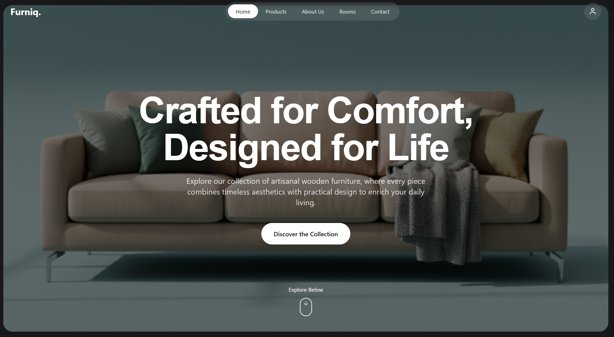

# Furniq - Modern Furniture Showcase

A visually stunning and interactive landing page for "Furniq," a modern furniture brand. This project showcases elegant designs through a clean, minimalist, and responsive user interface built with React, TypeScript, and Tailwind CSS.

The application is a single-page experience, highlighting product craftsmanship, design philosophy, and customer testimonials.


## ✨ Features

- **Dynamic Hero Section:** A full-screen hero image with a subtle parallax effect on scroll.
- **Interactive Product Carousel:** A sleek, 3D-style carousel to showcase featured products. It supports navigation via buttons and intuitive drag/swipe gestures.
- **Smooth Single-Page Navigation:** A navigation bar with links that smoothly scroll to different sections of the page.
- **Inspirational Room Gallery:** A beautiful masonry-style grid of room designs that open in a full-screen lightbox when clicked.
- **Fully Responsive:** The layout is meticulously crafted to look and work great on all devices, from mobile phones to widescreen desktops.
- **Clean UI/UX:** A focus on minimalist design, elegant typography, and smooth animations to provide a premium user experience.

## 🛠️ Tech Stack

- **React:** A JavaScript library for building user interfaces.
- **TypeScript:** A typed superset of JavaScript that compiles to plain JavaScript.
- **Tailwind CSS:** A utility-first CSS framework for rapid UI development.

## 🚀 Getting Started

To get a local copy up and running, follow these simple steps.

### Prerequisites

You need to have Node.js and npm (or yarn) installed on your machine.

### Installation

1.  Clone the repository:
    ```sh
    git clone https://github.com/BenazizaAbdelkaderRiyadh/furniq-showcase.git
    ```
2.  Navigate to the project directory:
    ```sh
    cd furniq-showcase
    ```
3.  Install the dependencies:
    ```sh
    npm install
    ```
### Running the Application

To start the development server, run:

```sh
npm run dev 
```

This will open the application in your default browser.

## 📂 Project Structure

The project follows a simple structure with the main files located in the root and all React components organized within the `components` directory.

```
.
├── components/         # Reusable React components
│   └── icons/          # SVG icon components
├── assets/             # Static images (as referenced in code)
├── index.html          # Main HTML file
├── index.tsx           # React application entry point
└── README.md
```
